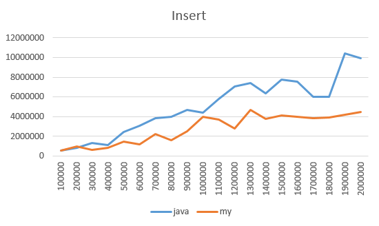

## Оценка эффективности
Синим цветом обозначено время выполнения операции над связным списком из стандартной библиотеки Java.
Красным - время выполнения операции над сторонним связным списком.
Все операции проводились в середине списка

### Операция вставки

### Операция чтения

### Операция удаления

Сторонняя реализация оказалась более эффективной при большем объеме данных
