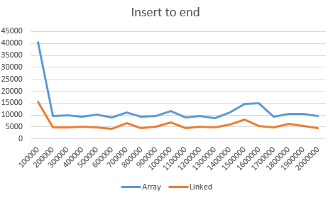
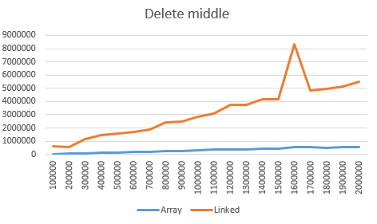

# Оценка эффективности
## Сравнение LinkedList со сторонней реализацией
Синим цветом обозначено время выполнения операции
над связным списком из стандартной библиотеки Java.
Красным - время выполнения операции над сторонней реализацией
связного списка.
Все операции проводились над серединой списка

### Операция вставки

### Операция чтения

### Операция удаления

Сторонняя реализация оказалась более эффективной
при большем объеме данных.

## Сравнение ArrayList и LinkedList
### Вставка

Вставка в начало связного списка выполняется за
константное время, т. к. для выполнения операции достаточно
поменять значения нескольких ссылок. В то время, как
вставка в начало массива требует смещения всех элементов
вправо.

Вставка в середину массива требует смещения n/2
элементов вправо, а вставка в список - поиска среднего элемента
(обход n/2 звеньев). Получается, что теоретическая
сложности для вставки в
середину списка и массива равны O(n). Но время вставки в
массив растет значительно медленнее. Такое происходит
из-за того, что смещение элементов в массиве выполняется
методом *System.arraycopy()*, который имеет нативную
реализацию и выполниется на уровне операционной
системы, а обход элементов в списке выполняется JVM. 

Вставка в конец массива требует записи элемента в
ячейку памяти, адрес которй может быть вычислен. Поэтому такая
операция будет выполнятся за O(1) (За исключением случаев,
когда количество значимых элементов в массиве равно его
размеру. В таком случае потребуется выделить новый участок
памяти размером 1.5*n, переписать в него старые значения и
записать новый элемент. В таком случае сложность составит O(n)).
Вставка в конец списка требует создания объекта и записи ссылок
на него. Такая операция всегда будет выполняться за O(1).

### Доступ

В списке содержится ссылка на первый элемент, поэтому
доступ к нему будет выполняться за O(1). Адресс любого
элемента массива может быть вычислен. Поэтому
к любому элементу можно получить доступ за O(1).

Что бы получить средний элемент из списка потребуется
обойти n/2 элементов. Соответственно сложность такой
операции - O(n).

В списке помимо ссылки на первый элемент храниться ссылка на
последний. Поэтому последний, как и первый
может быть получен за O(1). 

### Удаление

Удаление элемента из массива требует смещения всех
последующих влево. Сложность такой операции O(n).
Для списка же достаточно переписать несколько ссылок, то есть
скорость удаления не зависит от количества элементов.

Ситуация такая же как и со вставкий в середину. В массиве
смещение элементов происходит на уровне операционной системы,
а в списке обход элементов - на уровне JVM. Поэтому
смещение выполняется быстрее, чем обход.

Для удаления последнего элемента массива достаточно по
последнему адресу записать *null*. Для списка достаточно
переписать несколько
ссылок. То есть сложность выполнения для обеих структур не
зависит от количества элементов и будет равна O(1).

### Выводы
ArrayList будет показывать лучшиее результаты в
случаях, когда к данным часто обращаются, но сами данные
меняются не так часто.
LinkedList, напротив, будет эффективнее в случаях, когда
набор данных меняется часто. К тому же LinkedList имеет
накладные расход по памяти, связанные с хранением ссылок на
соседние звенья для каждого элемента.
